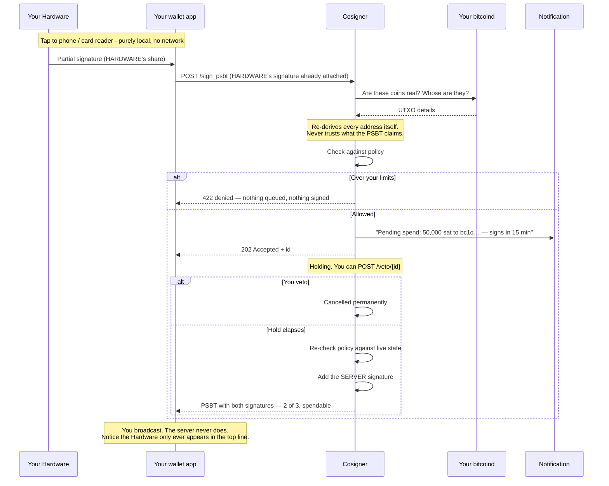

## How a spend actually works

**The Hardware never talks to the server. It has no networking - no WiFi, no Bluetooth, nothing
that reaches the internet.** It only ever talks to whatever taps it: your phone over NFC, or a
card reader plugged into a computer. Every "HARDWARE + SERVER" spend is really two separate,
disconnected steps stitched together by a PSBT file that your wallet app carries between them -
never a live connection between the card and this service.

The server never signs the moment you ask, either way. It queues, it tells you, it waits, and
only then does it sign - so a signature is never the first you hear about a transaction.

The cosigner never talks to the Hardware either — as far as this service is concerned, "HARDWARE
signed" just means *a PSBT arrived with a valid signature under HARDWARE's key already in it*. It
has no way to reach the card, ask it to sign, or know it exists except through that signature.
Your wallet app (Bitcoin Keeper, or Sparrow with a card reader) is the only thing that talks to
both sides — locally to the Hardware, over the network to the cosigner — and a PSBT file is the
only thing that ever crosses between them.

